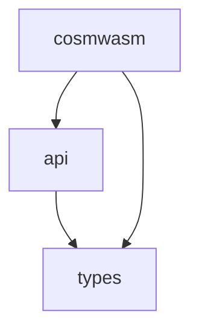

# wasmvm

This is a wrapper around the
[CosmWasm VM](https://github.com/CosmWasm/cosmwasm/tree/main/packages/vm). It
allows you to compile, initialize and execute CosmWasm smart contracts from Go
applications, in particular from
[x/wasm](https://github.com/CosmWasm/wasmd/tree/master/x/wasm).

More information on what is CosmWasm and how to use it can be found here:
[CosmWasm Docs](https://docs.cosmwasm.com). To generate and show
the Rust part documentation you can run `make doc-rust`.

## Structure

This repo contains both Rust and Go code. The Rust code is compiled into a
library (shared `.dll`/`.dylib`/`.so` or static `.a`) to be linked via cgo and
wrapped with a pleasant Go API. The full build step involves compiling Rust -> C
library, and linking that library to the Go code. For ergonomics of the user, we
will include pre-compiled libraries to easily link with, and Go developers
should just be able to import this directly.

### Rust code

The Rust code lives in a sub-folder `./libwasmvm`. This folder compiles to a
library that can be used via FFI. It is compiled like this:

```sh
# Run unit tests
(cd libwasmvm && cargo test)

# Create a release build for your current system. Uses whatever default Rust
# version you have installed.
make build-libwasmvm

# Create reproducible release builds for other systems (slow, don't use for development)
make release-build-alpine
make release-build-linux
make release-build-macos
make release-build-windows
```

### Go code

The Go code consists of three packages:

1. The types (the `github.com/CosmWasm/wasmvm/types` import), using
   `package types`
2. The internal package `internal/api`, using `package api`
3. This repo (the `github.com/CosmWasm/wasmvm` import), using `package cosmwasm`

The dependencies between them are as follows:



The Go code is built like this:

```
make build-go
make test
```

#### Package github.com/CosmWasm/wasmvm/types

This packages contains types used by the two other packages. It can be compiled
without cgo.

```sh
# Build
go build ./types
# Build without CGO
CGO_ENABLED=0 go build ./types
```

#### Package internal/api

This package contains the code binding the libwasmvm build to the Go code. All
low level FFI handling code belongs there. This package can only be built using
cgo. Using the `internal/` convention makes this package fully private.

#### Package github.com/CosmWasm/wasmvm

This is the package users import. It can be compiled without cgo, but when you
do so, a lot of functionality is removed.

```sh
# Build
go build .
# Build without CGO
CGO_ENABLED=0 go build .
```

In the case that it may be desirable to compile with cgo, but with libwasmvm
linking disabled an additional build tag is available.

```sh
# Build with CGO, but with libwasmvm linking disabled
go build -tags "nolink_libwasmvm"
```

## Supported Platforms

See [COMPILER_VERSIONS.md](docs/COMPILER_VERSIONS.md) for information on Go and
Rust compiler support.

The Rust implementation of the VM is compiled into a library called libwasmvm.
This is then linked to the Go code when the final binary is built. For that
reason not all systems supported by Go are supported by this project.

Linux (tested on Ubuntu, Debian, Alpine) and macOS are supported. We are working
on Windows support with very low priority (#288).

[#288]: https://github.com/CosmWasm/wasmvm/pull/288

### Builds of libwasmvm

Our system currently supports the following builds. In general we can only
support targets that are
[supported by Wasmer's singlepass backend](https://docs.wasmer.io/runtime/features#backend-support-by-chipset),
which for example excludes all 32 bit systems.

<!-- AUTO GENERATED BY libwasmvm_builds.py START -->

| OS family       | Arch    | Linking | Supported                    | Note                                                                                                                                   |
| --------------- | ------- | ------- | ---------------------------- | -------------------------------------------------------------------------------------------------------------------------------------- |
| Linux (glibc)   | x86_64  | shared  | ✅​libwasmvm.x86_64.so       |                                                                                                                                        |
| Linux (glibc)   | x86_64  | static  | 🚫​                          | Would link libwasmvm statically but glibc dynamically as static glibc linking is not recommended. Potentially interesting for Osmosis. |
| Linux (glibc)   | aarch64 | shared  | ✅​libwasmvm.aarch64.so      |                                                                                                                                        |
| Linux (glibc)   | aarch64 | static  | 🚫​                          |                                                                                                                                        |
| Linux (musl)    | x86_64  | shared  | 🚫​                          | Possible but not needed                                                                                                                |
| Linux (musl)    | x86_64  | static  | ✅​libwasmvm_muslc.x86_64.a  |                                                                                                                                        |
| Linux (musl)    | aarch64 | shared  | 🚫​                          | Possible but not needed                                                                                                                |
| Linux (musl)    | aarch64 | static  | ✅​libwasmvm_muslc.aarch64.a |                                                                                                                                        |
| macOS           | x86_64  | shared  | ✅​libwasmvm.dylib           | Fat/universal library with multiple archs ([#294])                                                                                     |
| macOS           | x86_64  | static  | ✅​libwasmvmstatic_darwin.a  | Fat/universal library with multiple archs ([#407])                                                                                     |
| macOS           | aarch64 | shared  | ✅​libwasmvm.dylib           | Fat/universal library with multiple archs ([#294])                                                                                     |
| macOS           | aarch64 | static  | ✅​libwasmvmstatic_darwin.a  | Fat/universal library with multiple archs ([#407])                                                                                     |
| Windows (mingw) | x86_64  | shared  | 🏗​wasmvm.dll                | Shared library linking not working on Windows ([#389])                                                                                 |
| Windows (mingw) | x86_64  | static  | 🚫​                          | Unclear if this can work using a cross compiler; needs research on .lib (MSVC toolchain) vs. .a (GNU toolchain). ([#389])              |
| Windows (mingw) | aarch64 | shared  | 🚫​                          | Shared library linking not working on Windows ([#389])                                                                                 |
| Windows (mingw) | aarch64 | static  | 🚫​                          | Unclear if this can work using a cross compiler; needs research on .lib (MSVC toolchain) vs. .a (GNU toolchain). ([#389])              |

[#294]: https://github.com/CosmWasm/wasmvm/pull/294
[#389]: https://github.com/CosmWasm/wasmvm/issues/389
[#407]: https://github.com/CosmWasm/wasmvm/issues/407

<!-- AUTO GENERATED BY libwasmvm_builds.py END -->

## gRPC Service Definition

The gRPC service definitions for interacting with wasmvm are provided in `proto/wasmvm.proto`. These definitions include messages and services for loading modules, instantiating contracts, executing functions, querying state, and host function callbacks.

To generate Go code:
```bash
protoc -I proto \
  --go_out=paths=source_relative:proto \
  --go-grpc_out=paths=source_relative:proto \
  proto/wasmvm.proto
```

To generate Rust code using `tonic-build`, add the following to your build script:
```rust
tonic_build::configure()
    .build_server(true)
    .build_client(true)
    .out_dir("src/generated")
    .compile(&["proto/wasmvm.proto"], &["proto"])
    .unwrap();
```

Ensure you have installed `protoc`, `protoc-gen-go`, and `protoc-gen-go-grpc` for Go, and `tonic-build` in your Rust project for Rust code generation.

## Rust gRPC Server

We've provided a Rust-based gRPC server implementation in `rpc-server`. This server
uses the native Rust `wasmvm` library and exposes the `WasmVMService` and `HostService`
over gRPC.

### Prerequisites

Ensure you have the Protocol Buffers compiler (`protoc`) installed:

- On macOS:
  ```bash
  brew install protobuf
  ```
- On Ubuntu/Debian:
  ```bash
  sudo apt-get update
  sudo apt-get install -y protobuf-compiler
  ```

### Building with tonic

The `rpc-server` crate uses `tonic-build` in its `build.rs` to generate Rust code
from `proto/wasmvm.proto` automatically during compilation. To build the server:

```bash
cd rpc-server
cargo build
```

Any changes to `proto/wasmvm.proto` will be picked up automatically on the next build. To force a full rebuild of generated code:

```bash
cargo clean
cargo build
```

To build and run:

```bash
cd rpc-server
cargo run --release -- 0.0.0.0:50051
```

This will start the server on the specified address (default `0.0.0.0:50051`).

You can configure the address using the `WASMVM_GRPC_ADDR` environment variable:

```bash
export WASMVM_GRPC_ADDR="127.0.0.1:50052"
cargo run --release
```

### Persistent Cache

The RPC server uses a persistent cache directory (`~/.wasmvm/cache` by default) that is shared across all instances. This design allows multiple chain daemons to benefit from the same compiled WASM modules:

- **Shared Cache**: Multiple chain daemons can use the same VM instance and benefit from cached compiled modules
- **Persistence**: Compiled WASM modules survive server restarts
- **Reduced Memory**: Only one copy of each compiled module in memory
- **Faster Loading**: Pre-compiled modules load instantly

Configure the cache location with the `WASMVM_CACHE_DIR` environment variable:

```bash
export WASMVM_CACHE_DIR=/path/to/custom/cache
```

See [rpc-server/CACHE_CONFIG.md](rpc-server/CACHE_CONFIG.md) for detailed configuration options.

## Development

There are two halves to this code - go and rust. The first step is to ensure that
there is a proper dll built for your platform. This should be `api/libwasmvm.X`,
where X is:

- `so` for Linux systems
- `dylib` for MacOS
- `dll` for Windows - Not currently supported due to upstream dependency

If this is present, then `make test` will run the Go test suite and you can
import this code freely. If it is not present you will have to build it for your
system, and ideally add it to this repo with a PR (on your fork). We will set up
a proper CI system for building these binaries, but we are not there yet.

To build the rust side, try `make build-libwasmvm` and wait for it to compile.
This depends on `cargo` being installed with `rustc` version 1.47+. Generally,
you can just use `rustup` to install all this with no problems.

## Testing

### Go Tests

Run the standard Go test suite:

```bash
make test
```

### Rust Tests

#### Library Tests (libwasmvm)

Run unit tests for the core Rust library:

```bash
cd libwasmvm
cargo test
```

#### RPC Server Tests

The `rpc-server` crate includes comprehensive test suites including critical security vulnerability tests.

**Run all tests:**
```bash
cd rpc-server
cargo test
```

**Run specific test categories:**

```bash
# Run all library tests (includes security tests)
cargo test --lib

# Run integration tests
cargo test --test integration_tests

# Run benchmarks
cargo test --lib benchmarks

# Run security vulnerability tests specifically
cargo test vm_security_vulnerabilities --lib

# Run individual security test categories
cargo test test_vm_field_length_vulnerabilities --lib
cargo test test_vm_encoding_vulnerabilities --lib
cargo test test_vm_boundary_value_vulnerabilities --lib
cargo test test_vm_special_character_vulnerabilities --lib
cargo test test_vm_json_structure_vulnerabilities --lib
```

**Run tests with output (recommended for security tests):**
```bash
# See detailed security test output
cargo test vm_security_vulnerabilities --lib -- --nocapture

# Run specific security test with full output
cargo test test_vm_security_summary --lib -- --nocapture
```

#### Security Testing

🚨 **CRITICAL**: The RPC server includes comprehensive security vulnerability tests that document real security issues discovered in the underlying wasmvm implementation.

**Security Test Categories (13 total):**

1. **Empty Checksum Acceptance** - Tests VM's handling of empty checksums
2. **Invalid JSON Processing** - Tests malformed JSON handling
3. **Checksum Validation Bypass** - Tests checksum validation consistency
4. **Context Field Validation** - Tests blockchain context validation
5. **Gas Limit Handling** - Tests extreme gas limit processing
6. **Message Size Vulnerabilities** - Tests large message handling
7. **Field Length Validation Bypass** - Tests extremely long field values (1MB+)
8. **Encoding Validation Bypass** - Tests malformed character encodings
9. **Boundary Value Vulnerabilities** - Tests extreme numeric values
10. **Special Character Injection** - Tests dangerous character patterns
11. **JSON Structure Complexity Bombs** - Tests complex JSON structures
12. **Concurrent Attack Resistance** - Tests concurrent malicious requests
13. **Security Summary** - Comprehensive vulnerability documentation

**Run the complete security test suite:**
```bash
cd rpc-server
cargo test vm_security_vulnerabilities --lib -- --nocapture
```

**Expected Results:**
- ✅ All 13 security tests should **PASS**
- ⚠️ **failing tests indicate vulnerabilities exist** (this is the correct behavior)
- 📋 Tests document that the VM accepts inputs it should reject

**Security Findings:**
The security tests reveal critical vulnerabilities including:
- VM accepts 1MB+ field values without limits
- VM processes malformed character encodings
- VM accepts dangerous injection patterns
- VM handles extreme boundary values unsafely
- VM processes complex JSON bombs without limits

See `rpc-server/SECURITY_FINDINGS.md` for detailed vulnerability documentation.

#### Performance and Load Testing

**Run performance benchmarks:**
```bash
cd rpc-server
cargo test benchmarks --lib -- --nocapture
```

**Run stress tests:**
```bash
# Memory and performance stress tests
cargo test stress_test --lib -- --nocapture

# Concurrent load testing
cargo test test_concurrent --lib -- --nocapture
```

#### Input Validation Testing

**Run comprehensive input validation tests:**
```bash
cd rpc-server
cargo test savage_input_validation_tests --lib -- --nocapture
cargo test type_safety_and_authorization_tests --lib -- --nocapture
```

These tests include:
- Malicious checksum injection attempts
- Buffer overflow attempts
- JSON payload attacks
- Gas limit attacks
- Context field attacks
- WASM module attacks
- Concurrent malicious request simulation

#### Test Output Interpretation

**Security Test Results:**
```
running 13 tests
test vm_security_vulnerabilities::test_vm_accepts_empty_checksum_vulnerability ... ok
test vm_security_vulnerabilities::test_vm_accepts_invalid_json_with_fake_checksum ... ok
test vm_security_vulnerabilities::test_vm_field_length_vulnerabilities ... ok
test vm_security_vulnerabilities::test_vm_encoding_vulnerabilities ... ok
test vm_security_vulnerabilities::test_vm_boundary_value_vulnerabilities ... ok
test vm_security_vulnerabilities::test_vm_special_character_vulnerabilities ... ok
test vm_security_vulnerabilities::test_vm_json_structure_vulnerabilities ... ok
test vm_security_vulnerabilities::test_vm_concurrent_stress_vulnerabilities ... ok
test vm_security_vulnerabilities::test_vm_security_summary ... ok
```

**✅ All tests passing = Critical vulnerabilities confirmed**

#### Continuous Integration

For CI/CD pipelines, run the full test suite:

```bash
# Complete test coverage
cd rpc-server
cargo test --all-targets --all-features

# With security test output
cargo test --lib -- --nocapture | tee test_results.log

# Performance validation
cargo test benchmarks --lib --release
```

#### Test Development

When adding new security tests:

1. Add tests to `rpc-server/src/vm_behavior_tests.rs`
2. Follow the existing pattern for vulnerability documentation
3. Ensure tests demonstrate the vulnerability clearly
4. Update the security summary test count
5. Document findings in `SECURITY_FINDINGS.md`

**Example test structure:**
```rust
#[tokio::test]
async fn test_new_vulnerability_category() {
    let service = create_test_service();
    
    // Test malicious input
    let malicious_input = "dangerous_pattern";
    let request = create_test_request(malicious_input);
    let response = service.some_method(request).await;
    
    // Verify vulnerability exists (test should pass if VM accepts bad input)
    assert!(response.is_ok(), "VM should handle gracefully");
    let resp = response.unwrap().into_inner();
    
    // Document the vulnerability
    println!("🚨 VULNERABILITY: VM accepts {}", malicious_input);
}
```
