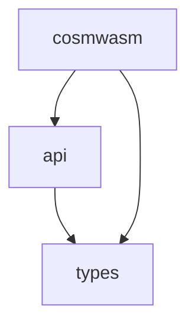

# wasmvm

This is a wrapper around the
[CosmWasm VM](https://github.com/CosmWasm/cosmwasm/tree/main/packages/vm). It
allows you to compile, initialize and execute CosmWasm smart contracts from Go
applications, in particular from
[x/wasm](https://github.com/CosmWasm/wasmd/tree/master/x/wasm).

More information on what is CosmWasm and how to use it can be found here:
[CosmWasm Docs](https://docs.cosmwasm.com). To generate and show
the Rust part documentation you can run `make doc-rust`.

## Structure

This repo contains both Rust and Go code. The Rust code is compiled into a
library (shared `.dll`/`.dylib`/`.so` or static `.a`) to be linked via cgo and
wrapped with a pleasant Go API. The full build step involves compiling Rust -> C
library, and linking that library to the Go code. For ergonomics of the user, we
will include pre-compiled libraries to easily link with, and Go developers
should just be able to import this directly.

### Rust code

The Rust code lives in a sub-folder `./libwasmvm`. This folder compiles to a
library that can be used via FFI. It is compiled like this:

```sh
# Run unit tests
(cd libwasmvm && cargo test)

# Create a release build for your current system. Uses whatever default Rust
# version you have installed.
make build-libwasmvm

# Create reproducible release builds for other systems (slow, don't use for development)
make release-build-alpine
make release-build-linux
make release-build-macos
make release-build-windows
```

### Go code

The Go code consists of three packages:

1. The types (the `github.com/CosmWasm/wasmvm/types` import), using
   `package types`
2. The internal package `internal/api`, using `package api`
3. This repo (the `github.com/CosmWasm/wasmvm` import), using `package cosmwasm`

The dependencies between them are as follows:



The Go code is built like this:

```
make build-go
make test
```

#### Package github.com/CosmWasm/wasmvm/types

This packages contains types used by the two other packages. It can be compiled
without cgo.

```sh
# Build
go build ./types
# Build without CGO
CGO_ENABLED=0 go build ./types
```

#### Package internal/api

This package contains the code binding the libwasmvm build to the Go code. All
low level FFI handling code belongs there. This package can only be built using
cgo. Using the `internal/` convention makes this package fully private.

#### Package github.com/CosmWasm/wasmvm

This is the package users import. It can be compiled without cgo, but when you
do so, a lot of functionality is removed.

```sh
# Build
go build .
# Build without CGO
CGO_ENABLED=0 go build .
```

In the case that it may be desirable to compile with cgo, but with libwasmvm
linking disabled an additional build tag is available.

```sh
# Build with CGO, but with libwasmvm linking disabled
go build -tags "nolink_libwasmvm"
```

## Supported Platforms

See [COMPILER_VERSIONS.md](docs/COMPILER_VERSIONS.md) for information on Go and
Rust compiler support.

The Rust implementation of the VM is compiled into a library called libwasmvm.
This is then linked to the Go code when the final binary is built. For that
reason not all systems supported by Go are supported by this project.

Linux (tested on Ubuntu, Debian, Alpine) and macOS are supported. We are working
on Windows support with very low priority (#288).

[#288]: https://github.com/CosmWasm/wasmvm/pull/288

### Builds of libwasmvm

Our system currently supports the following builds. In general we can only
support targets that are
[supported by Wasmer's singlepass backend](https://docs.wasmer.io/runtime/features#backend-support-by-chipset),
which for example excludes all 32 bit systems.

<!-- AUTO GENERATED BY libwasmvm_builds.py START -->

| OS family       | Arch    | Linking | Supported                    | Note                                                                                                                                   |
| --------------- | ------- | ------- | ---------------------------- | -------------------------------------------------------------------------------------------------------------------------------------- |
| Linux (glibc)   | x86_64  | shared  | ✅​libwasmvm.x86_64.so       |                                                                                                                                        |
| Linux (glibc)   | x86_64  | static  | 🚫​                          | Would link libwasmvm statically but glibc dynamically as static glibc linking is not recommended. Potentially interesting for Osmosis. |
| Linux (glibc)   | aarch64 | shared  | ✅​libwasmvm.aarch64.so      |                                                                                                                                        |
| Linux (glibc)   | aarch64 | static  | 🚫​                          |                                                                                                                                        |
| Linux (musl)    | x86_64  | shared  | 🚫​                          | Possible but not needed                                                                                                                |
| Linux (musl)    | x86_64  | static  | ✅​libwasmvm_muslc.x86_64.a  |                                                                                                                                        |
| Linux (musl)    | aarch64 | shared  | 🚫​                          | Possible but not needed                                                                                                                |
| Linux (musl)    | aarch64 | static  | ✅​libwasmvm_muslc.aarch64.a |                                                                                                                                        |
| macOS           | x86_64  | shared  | ✅​libwasmvm.dylib           | Fat/universal library with multiple archs ([#294])                                                                                     |
| macOS           | x86_64  | static  | ✅​libwasmvmstatic_darwin.a  | Fat/universal library with multiple archs ([#407])                                                                                     |
| macOS           | aarch64 | shared  | ✅​libwasmvm.dylib           | Fat/universal library with multiple archs ([#294])                                                                                     |
| macOS           | aarch64 | static  | ✅​libwasmvmstatic_darwin.a  | Fat/universal library with multiple archs ([#407])                                                                                     |
| Windows (mingw) | x86_64  | shared  | 🏗​wasmvm.dll                | Shared library linking not working on Windows ([#389])                                                                                 |
| Windows (mingw) | x86_64  | static  | 🚫​                          | Unclear if this can work using a cross compiler; needs research on .lib (MSVC toolchain) vs. .a (GNU toolchain). ([#389])              |
| Windows (mingw) | aarch64 | shared  | 🚫​                          | Shared library linking not working on Windows ([#389])                                                                                 |
| Windows (mingw) | aarch64 | static  | 🚫​                          | Unclear if this can work using a cross compiler; needs research on .lib (MSVC toolchain) vs. .a (GNU toolchain). ([#389])              |

[#294]: https://github.com/CosmWasm/wasmvm/pull/294
[#389]: https://github.com/CosmWasm/wasmvm/issues/389
[#407]: https://github.com/CosmWasm/wasmvm/issues/407

<!-- AUTO GENERATED BY libwasmvm_builds.py END -->

## gRPC Service Definition

The gRPC service definitions for interacting with wasmvm are provided in `proto/wasmvm.proto`. These definitions include messages and services for loading modules, instantiating contracts, executing functions, querying state, and host function callbacks.

To generate Go code:
```bash
protoc -I proto \
  --go_out=paths=source_relative:proto \
  --go-grpc_out=paths=source_relative:proto \
  proto/wasmvm.proto
```

To generate Rust code using `tonic-build`, add the following to your build script:
```rust
tonic_build::configure()
    .build_server(true)
    .build_client(true)
    .out_dir("src/generated")
    .compile(&["proto/wasmvm.proto"], &["proto"])
    .unwrap();
```

Ensure you have installed `protoc`, `protoc-gen-go`, and `protoc-gen-go-grpc` for Go, and `tonic-build` in your Rust project for Rust code generation.

## Rust gRPC Server

We've provided a Rust-based gRPC server implementation in `rpc-server`. This server
uses the native Rust `wasmvm` library and exposes the `WasmVMService` and `HostService`
over gRPC.

### Prerequisites

Ensure you have the Protocol Buffers compiler (`protoc`) installed:

- On macOS:
  ```bash
  brew install protobuf
  ```
- On Ubuntu/Debian:
  ```bash
  sudo apt-get update
  sudo apt-get install -y protobuf-compiler
  ```

### Building with tonic

The `rpc-server` crate uses `tonic-build` in its `build.rs` to generate Rust code
from `proto/wasmvm.proto` automatically during compilation. To build the server:

```bash
cd rpc-server
cargo build
```

Any changes to `proto/wasmvm.proto` will be picked up automatically on the next build. To force a full rebuild of generated code:

```bash
cargo clean
cargo build
```

To build and run:

```bash
cd rpc-server
cargo run --release -- 0.0.0.0:50051
```

This will start the server on the specified address (default `0.0.0.0:50051`).

You can configure the address using the `WASMVM_GRPC_ADDR` environment variable:

```bash
export WASMVM_GRPC_ADDR="127.0.0.1:50052"
cargo run --release
```

## Development

There are two halves to this code - go and rust. The first step is to ensure that
there is a proper dll built for your platform. This should be `api/libwasmvm.X`,
where X is:

- `so` for Linux systems
- `dylib` for MacOS
- `dll` for Windows - Not currently supported due to upstream dependency

If this is present, then `make test` will run the Go test suite and you can
import this code freely. If it is not present you will have to build it for your
system, and ideally add it to this repo with a PR (on your fork). We will set up
a proper CI system for building these binaries, but we are not there yet.

To build the rust side, try `make build-libwasmvm` and wait for it to compile.
This depends on `cargo` being installed with `rustc` version 1.47+. Generally,
you can just use `rustup` to install all this with no problems.
